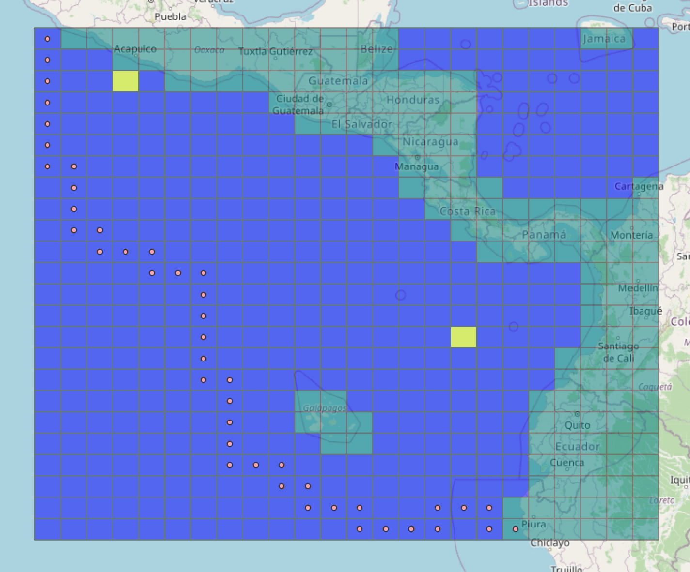

### A Basic Reinforcement Learning example using temporal difference Q-learning

Adapted from [this](https://github.com/michaeltinsley/Gridworld-with-Q-Learning-Reinforcement-Learning-/blob/master/Gridworld.ipynb) example for quick experiment iteration. Useful  for understanding of agent performance to help inform decisions for adapting the Neural-MMO environment.

Example track with two predators on 24 x 24 grid:

